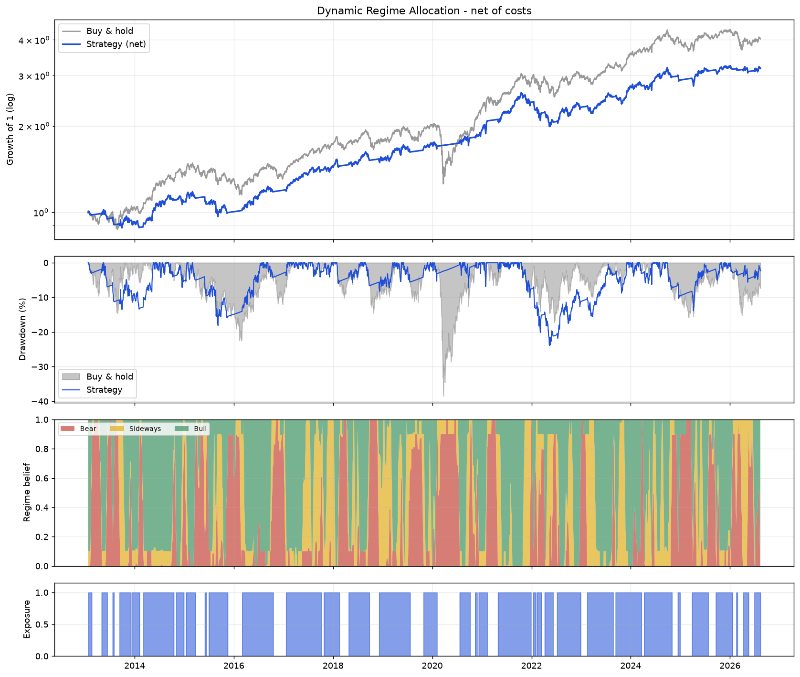

# Dynamic-Regime-Allocation

### A fee-aware, regime-switching allocation strategy using Gaussian HMMs


## Overview

**Dynamic-Regime-Allocation** allocates between the **Nifty 50** and cash. Rather
than forecasting prices, it uses an unsupervised **Gaussian Hidden Markov Model**
to infer which of three latent regimes — bull, sideways, bear — the market is
currently in, and sizes exposure from those probabilities.

The model is fit **walk-forward**: every 10 trading days it is refit on the
trailing 5 years and then scores only the 10 days that follow. No parameter,
scaler, or state label is ever derived from a bar the model has already been
asked to trade.

---

## Results (2013-01-24 → 2026-08-13, net of costs)

| Metric | Strategy | Buy & hold |
| :--- | ---: | ---: |
| Total return | 217.68% | **302.95%** |
| CAGR | 8.91% | **10.83%** |
| Volatility (ann.) | **11.12%** | 16.18% |
| Sharpe (vs cash) | 0.30 | **0.36** |
| Sortino | 0.35 | **0.46** |
| **Max drawdown** | **-23.89%** | -38.44% |
| **Calmar** | **0.37** | 0.28 |
| Longest underwater | 776 d | **741 d** |
| Worst day | **-5.93%** | -12.98% |
| Time in market | 69.01% | 100% |
| Trades | 65 | — |
| Costs paid | 6.50% of capital | — |

**Read this honestly.** The strategy does *not* beat the index. It gives up
about 2 points of CAGR and lands slightly behind on Sharpe. What it buys is a
materially smaller hole: max drawdown falls by a third, the worst single day is
less than half as bad, and Calmar — return per unit of worst-case pain — is the
one headline measure where it wins. Whether that trade is worth making is a
question about the holder, not about the model.



### What actually happened in 2020

The COVID crash is the model's best moment and it is a genuine one. It exited on
**2020-02-05** at 12,089 — three sessions after `P(Bear)` crossed the threshold,
and within 2% of the all-time high — and stayed in cash through the bottom.

| | Feb–Apr 2020 drawdown |
| :--- | ---: |
| Buy & hold | -38.4% |
| Strategy | **-5.3%** |

---

## Methodology

### 1. Features

Three scale-free inputs, so a window from 2013 (Nifty ~6,000) and one from 2026
(Nifty ~24,000) live on the same axes:

* **Volatility** — 20-day annualised rolling stdev of returns.
* **Trend (Z-score)** — price distance from its 50-day mean, in sigmas.
* **Momentum** — trailing 14-day *return*.

### 2. Walk-forward Gaussian HMM

Refit every 10 days on a trailing 1,250-day window, best-of-3 EM restarts by
in-sample log-likelihood. Latent state labels are arbitrary and permute between
fits, so states are re-identified each window by their mean trend feature and
ordered bear → sideways → bull.

### 3. Belief smoothing

A 10-day moving average is applied to the regime probabilities, so a signal must
persist for about two weeks before capital moves. This is the main churn
control: it holds the strategy to 65 trades across 13 years.

### 4. Cost model

* **Friction** — 0.1% per unit of exposure traded (brokerage + STT + slippage).
* **Cash yield** — un-invested capital earns 6% annualised (liquid/overnight funds).
* **Financing** — exposure above 1x is charged 6% + 2% spread.

---

## Allocation rule

| Regime | Condition | Exposure |
| :--- | :--- | ---: |
| Strong bull | P(Bull) > 80% | 1.5x *(off by default — see below)* |
| Bull | P(Bull) > 60% | 1.0x |
| Sideways | P(Side) > 60% and Z > -0.5 | 1.0x |
| Bear | P(Bear) > 60% | 0x |

The rule is deliberately **sticky**: once invested, only a bear reading returns
it to cash. Exiting on "not bullish enough" was what produced most of the churn.
The 80% / 75% pair forms a hysteresis band so the top tier cannot flip on and
off around a single threshold.

### On the 1.5x tier

The aggressive tier ships **disabled** (`leverage_max = 1.0`). It is implemented
and correct — enable it with `--leverage-max 1.5` — but on this data it makes
every risk-adjusted measure worse once financing and the extra turnover are
charged for:

| | 1.0x (default) | 1.5x tier enabled |
| :--- | ---: | ---: |
| CAGR | **8.91%** | 7.94% |
| Sharpe | **0.30** | 0.20 |
| Max drawdown | **-23.89%** | -28.12% |
| Calmar | **0.37** | 0.28 |
| Trades | **65** | 159 |
| Costs paid | **6.50%** | 11.25% |

---

## Installation & usage

```bash
git clone https://github.com/SahilMotyar/Dynamic-Regime-Allocation.git
cd Dynamic-Regime-Allocation
pip install -r requirements.txt
python hmm.py
```

Every assumption is a flag; `python hmm.py --help` lists them all.

```bash
# a different index, and no chart window
python hmm.py --ticker ^GSPC --start 2005-01-01 --no-plot

# stress the cost assumptions
python hmm.py --tx-cost 0.003 --cash-rate 0.04

# enable the aggressive tier, save the outputs
python hmm.py --leverage-max 1.5 --save-plot docs/levered.png --save-csv outputs/levered.csv
```

Prices are cached under `data_cache/` and reused for the rest of the day; pass
`--refresh` to force a re-download.

### Tests

```bash
pip install -r requirements-dev.txt
pytest
```

49 tests, no network access required — the model tests run against a synthetic
two-regime price path.

---

## Live signal

The run ends with a trade card for the next session. It reads the target
exposure straight out of the backtest's final row, so the recommendation is by
construction the same rule that produced the table above.

```
==========================================================
                 LIVE SIGNAL - 2026-08-13
==========================================================
  Last close                   24,395.85
  Trend (Z-score)                   0.84 sigma
  Volatility (ann.)                10.3%
----------------------------------------------------------
  Regime beliefs (smoothed):
    Bear                            0.4%
    Sideways                        0.1%
    Bull                           99.5%
----------------------------------------------------------
  Currently held                   1.00x
  Target exposure                  1.00x
  Regime               INVESTED - standard, 1.00x
  Action                           HOLD
==========================================================
```

---

## Known limitations

* **The backtest starts in 2013, not 2007.** The first 1,250 trading days are
  consumed by the initial training window. Earlier versions padded that warm-up
  with a uniform 1/3 prior, which kept the strategy in cash — earning 6% — right
  through 2008. That produced a flat line across the crash that looked like
  regime detection but was just an untrained model sitting in cash. The warm-up
  is now `NaN` and those rows are dropped.
* **One asset, one market.** Results on Nifty over one 13-year sample; the
  thresholds have not been validated out-of-sample on other indices.
* **Thresholds are hand-set**, not fit. They have not been walk-forward
  optimised, which is a virtue (nothing is fit to the test period) and a
  limitation (nothing says they are near-optimal).
* **No slippage model on gaps.** Exits are filled at the close of the signal
  day; a genuine crash open would fill worse.
* **Survivorship and index reconstitution** in the underlying Nifty series are
  taken as given from the data provider.

---

## Project layout

```
regime_allocation/
  config.py      dataclasses holding every tunable parameter
  data.py        download, on-disk cache, feature engineering
  model.py       walk-forward HMM, state ordering, belief smoothing
  strategy.py    the allocation rule (shared by backtest and live signal)
  backtest.py    position lagging and net-of-cost PnL accounting
  metrics.py     risk/return statistics and the comparison table
  reporting.py   trade card and charts
  cli.py         argument parsing and orchestration
hmm.py           entry point: python hmm.py
tests/           49 tests, no network required
```

---

## Disclaimer

*Educational and research use only. This is not financial advice. Algorithmic
trading carries significant risk, and past performance does not indicate future
results.*
